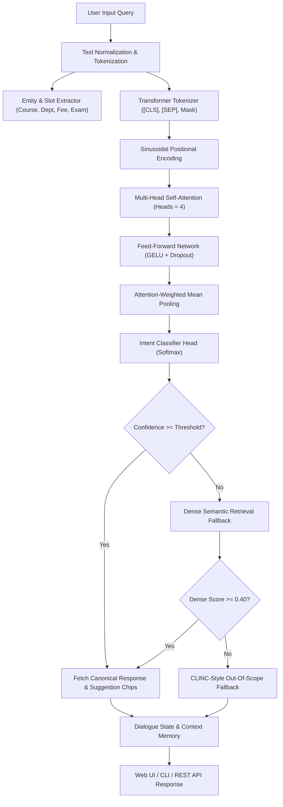

# 🎓 Transformer-Based College Enquiry Chatbot

An intelligent, production-ready, Transformer-based chatbot engineered to answer prospective and enrolled students' queries regarding **Courses**, **Fees**, **Exams**, **Departments**, **Timings**, and **Facilities**.

The chatbot features a **custom Multi-Head Self-Attention Transformer Encoder architecture**, a **Bitext / CLINC-150 style augmented intent dataset**, **joint entity/slot extraction**, and both an **interactive terminal CLI** and a **modern Glassmorphism Web Interface**.

---

## 🌟 Key Features

1. **6 Core College Operational & Academic Domains**:
   - 📚 **Courses**: Undergraduate (B.Tech, BCA, B.Sc), Postgraduate (M.Tech, MBA, MCA), eligibility criteria, durations, and credit curricula.
   - 💰 **Fees**: Annual tuition breakdown, hostel & mess charges, semester exam fees, merit scholarships, fee waivers, online payments, and installment options.
   - 📝 **Exams**: Semester datesheets, mid-terms, admit card / hall ticket generation, 75% attendance rules, 10-point CGPA grading scale, revaluation, and backlog clearance.
   - 🏛️ **Departments**: Computer Science (CSE), Electronics (ECE), Mechanical, Civil, Management (MBA/BBA), HOD profiles, faculty details, and research labs.
   - ⏰ **Timings**: Daily college lecture hours, central library 24/7 reading hall timings, administrative office / fee counter hours, and sports complex timings.
   - 🏢 **Facilities**: Hostels (AC/Non-AC, food mess), Central Library (IEEE/Springer access), Gigabit Wi-Fi 6, campus bus transport fleet, cafeteria/food court, athletic sports grounds, and 24/7 emergency health center.

2. **Transformer-Powered Intent Classification & Semantic Retrieval**:
   - **Custom Transformer Encoder from Scratch**: Full implementation of Multi-Head Scaled Dot-Product Attention, Sinusoidal Positional Encoding, and Feed-Forward Networks with Residual Connections and Layer Normalization.
   - **Hugging Face Fine-Tuning Pipeline**: Support for fine-tuning `distilbert-base-uncased` or MiniLM models.
   - **Hybrid Dense Retrieval**: Cosine similarity semantic search over the FAQ knowledge base for nuanced or composite questions.

3. **Bitext & CLINC-Style Robustness**:
   - Multi-turn state tracking.
   - Synthetic query paraphrase expansion (synonym substitutions, colloquial query prefixes, punctuation variations).
   - Calibrated confidence thresholding with Out-Of-Scope (OOS) fallback rejection to prevent hallucinations.

4. **Multiple Interfaces**:
   - 💻 **Interactive CLI**: Colorized terminal chat with real-time intent, confidence, and slot displays.
   - 🌐 **Modern Web UI**: Responsive glassmorphism interface with domain filtering chips, follow-up suggestion pills, voice recognition (Speech-to-Text), text-to-speech voice output, and transcript export.
   - 📡 **REST API**: Clean endpoints (`/api/chat`, `/api/faq`, `/api/categories`, `/health`).

---

## 🏗️ System Architecture



---

## 📁 Project Directory Structure

```text
college_enquiry_chatbot/
├── data/
│   ├── college_faq_dataset.json  # Comprehensive FAQ knowledge base (23 intents, 6 domains)
│   ├── entity_rules.json         # Taxonomy for slot & entity extraction
│   ├── train.json                # Augmented training split (70%)
│   ├── val.json                  # Validation split (15%)
│   ├── test.json                 # Test split (15%)
│   └── metadata.json             # Dataset statistics and mapping dictionaries
├── models/
│   ├── __init__.py
│   ├── custom_transformer.py     # Pure PyTorch Multi-Head Self-Attention Transformer
│   ├── dense_retriever.py        # Semantic embedding & cosine similarity retriever
│   └── hf_transformer.py         # Hugging Face DistilBERT fine-tuning pipeline
├── src/
│   ├── __init__.py
│   ├── tokenizer.py              # Word/subword tokenizer with special tokens
│   ├── dataset.py                # Bitext/CLINC query generator & PyTorch Dataset
│   ├── train.py                  # PyTorch training loop (AdamW, Cosine LR, Checkpoints)
│   ├── evaluate.py               # Precision, Recall, F1-Score, and Accuracy report
│   ├── chatbot.py                # Core dialogue orchestration & state tracking
│   └── cli.py                    # Terminal interactive chat interface
├── web/
│   ├── app.py                    # REST API server (FastAPI with built-in http.server fallback)
│   └── index.html                # Responsive Glassmorphism chat application
├── requirements.txt              # Optional deep learning & server dependencies
├── run_demo.py                   # Automated end-to-end demonstration & test suite
└── README.md                     # Documentation & user guide
```

---

## 🚀 Quickstart Guide

### 1. Run the Automated Verification Demo
Execute the automated test suite to verify all 6 domains and view the self-attention matrix:
```bash
python run_demo.py
```

### 2. Launch the Interactive Web Chatbot
Start the local web server:
```bash
python web/app.py
```
Open your browser and navigate to:
👉 **[http://127.0.0.1:8000](http://127.0.0.1:8000)**

### 3. Chat Directly via Terminal CLI
If you prefer a terminal session:
```bash
python src/cli.py
```

---

## 🔬 Training & Evaluation

### Train Custom PyTorch Transformer
```bash
python src/train.py
```
This trains the Multi-Head Attention model using AdamW with cosine annealing and saves `checkpoints/best_transformer.pt`.

### Run Test Set Evaluation
```bash
python src/evaluate.py
```
Evaluates accuracy, macro F1, and per-intent precision/recall on the held-out test split.

---

## 📡 REST API Reference

| Method | Endpoint | Description |
| :--- | :--- | :--- |
| `POST` | `/api/chat` | Send `{"message": "string"}` to get response, intent, confidence, entities, and suggestions |
| `POST` | `/api/reset` | Clears dialog context and session history |
| `GET` | `/api/categories` | Returns the list of supported college enquiry categories |
| `GET` | `/api/faq` | Returns the entire canonical FAQ knowledge base |
| `GET` | `/health` | Healthcheck endpoint returning server and college status |
